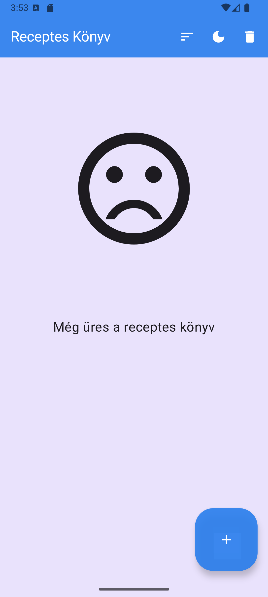
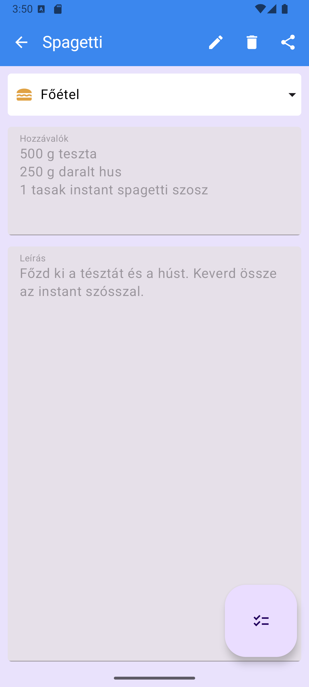

# Házi feladat dokumentáció

### Receptes_Konyv

## Bemutatás

A Receptes könyvben recepteket lehet tárolni, módosítani és megtekinteni. Az alkalmazás mindenki számára hasznos lehet, aki szabad idejében szokott és szeret főzni.

## Főbb funkciók

- Az alkalmazásban fel lehet venni új recepteket, azokat módosítani és megtekinteni.
- A recepteket át lehet küldeni más alkalmazások számára.
- A recepteket át lehet alakítani egy hozzávaló listába, ahol azokat ki lehet pipálni, ha már hozzáadtuk az ételhez.
- Az alkalmazás témája módosítható.
- A megtekintés nézetben ki lehet törölni az adott receptet.
- Egy gomb megnyomásával törölhetjük az összes receptet.
- Az alkalmazásban eltárolt receptek sorrendjét lehet rendezni Abc sorrend vagy dátum szerint.

## Felhasználói kézikönyv

Az alkalmazás elindításakor először lejátszódik egy töltőképernyő animáció.

 Ezután az alkalmazásban tárolt receptek lista nézete fogadja a felhasználót, ha már van benne recept, ha pedig nincs akkor arra is egy külön kép várja. Itt a felhasználó meg tudja változtatni az alkalmazás témáját.

Az itt levő recepteket a felhasználó különböző szempontok szerint tudja rendezni. Képes abc sorrendbe vagy a létrehozás/módosítás ideje szerint rendezni őket, vagy akár csak az adatbázisból beolvasott sorrendbe megnézni. A felhasználó a kuka ikonnal ellátott gomb segítségével ki tudja törölni az összes receptet a listából.

- 1. ábra: Itt látható maga a dropdown menü, amiből ki tudja választani a felhasználó, hogy melyiket szeretnénk, a háttérben pedig látható az abc sorrend szerinti rendezés.

- 2. ábra: Itt látszódik a dátum szerinti sorrend.

- 3. ábra: Itt látható az adatbázisból beolvasott sorrendben.

A plusz gomb segítségével a felhaszáló áttér a recept készítés képernyőre. Itt a felhasználó meg tudja adni a recept nevét, típusát, a szükséges hozzávalókat sortöréssel elválasztva és a leírását. A recept típusát a felhasználó az alábbi lehetőségek közül választhatja ki:
- Egyéb
- Főétel
- Leves
- Desszert

A receptes listából a felhasználó bármelyik receptet ki tudja választani és meg tudja tekinteni. A recept megtekintésének a képernyőjén ki tudja törölni az adott receptet a kuka ikonú gomb segítségével, vagy akár meg is tudja osztani a megosztás gomb segítségével.

A megtekintés képernyőnél a ceruza ikonú gomb segítségével szerkeszteni tudja a felhasználó a receptet. Az itt megjelenő szerkesztő felület megegyezik a recept készítésénél található képernyővel. A módosítások mentése után megváltozik a hozzá tartozó dátum és mostmár a listában a "Létrehozva" felirat helyett "Módosítva" felirat lesz a receptnél.

A megtekintés képernyőn a pipás lista ikonú gomb segítségével képes egy hozzávaló listát készíteni, ahol a recepthez szükséges hozzávalókat ki tudja pipálni, ha már hozzá adta.

## Felhasznált technológiák:

- **UI**: A felhasználói felület elkészítéshez Compose-t és MVVM architektúrát alkalmazok.
- **SQLite alapú adatbáziskezelés**: A lementett recepteket perzisztencia segítségével fogja tárolni a program.
- **DataStore alapú beállítások mentése**: DataStore segítségével menti le az alkalmazás, hogy milyen témát használ a felhasználó és, hogy mi szerint rendezi a listát.
- **Stílusok/témák**: Az alkalmazásban be lehet állítani a témáját.
- **Animáció**: Az alkalmazás elindulása előtt lejátszik egy animációt.
- **Dependency Injection**: Dependency injection segítségével inicializálódnak a ViewModel-lek. 

## Fontosabb technológiai megoldások

A legérdekesebb funkció az a téma és a rendezés beállításához használt DataStore. A laborok során nem találkoztunk vele, ezért idegen volt számomra még az elején, de szerintem nagyon hasznos funkció a beállítások tárolásához.
